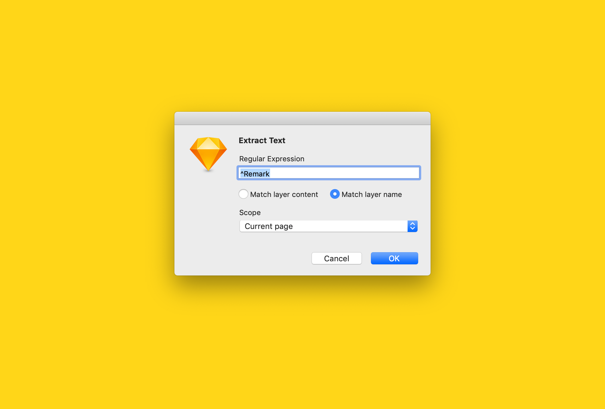

# Extract Text 

> A Sketch plugin to extract text from layers that match a regular expression

- Useful for extracting annotations from UX specifications

## Commands

### Extract Text

- Copies to the clipboard the text in layers that match a regular expression
- Can be configured to match either the layer content or the layer name against the regular expression
- Can be configured to operate on text layers in the selection or on text layers in the current page or document

## Installation

1. [Download and unzip the latest release](https://github.com/yuanqing/sketch-extract-text/releases)
2. Double-click `Extract Text.sketchplugin` to install

## License

[MIT](LICENSE.md)
